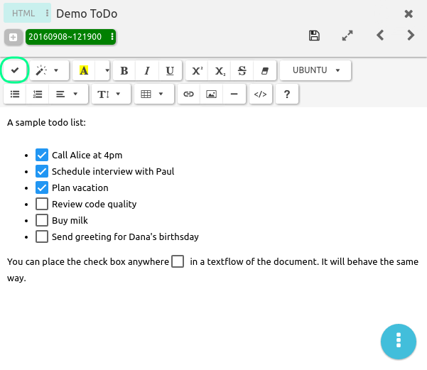

# Taking notes with TagSpaces

TagSpaces has the ability to create and edit new files in [plain text](/extensions/editorText.html), [HTML](/extensions/editorHTML.html) and [markdown](/extensions/viewerMD.html). With these functions the application can be used as valuable alternative to note taking and personal wiki systems such as Evernote, Onenote, TidyWiki and others.

## Evernote alternative

Some typical Evernote use cases includes:

* Saving web pages and other digital artefacts
* Creating and editing notes
* Organizing documents with tags in collections
* Distributing the collected artefacts across different devices such as smart phones and tablets

Evernote is a cloud based service for collecting and organizing of digital artefacts such as web clips, pictures and documents. Despite all the cool features, I was still concerned about the fact the Evernote stores all the data I have collected over the years on servers somewhere in the cloud. Saving of web pages sounds as a trivial task, but it has some tricks. For example, if you try to save a web page with all the images in it in Firefox, it will create a HTML file and a separate folder containing all the included images, CSS and other files. This functionality has one major drawback - the main HTML file can be easily separated from the folder with images. So now I was searching for a file format saving all the web page content in one single file, and I came to [MHTL format](http://en.wikipedia.org/wiki/MHTML). This format is based on this RFC <a title="RFC 2557" href="http://tools.ietf.org/html/rfc2557" target="_blank">specification</a>. The good news was that many internet browsers are supporting this format either OOTB (out of the box) or with the help of third-party extensions. Some popular rich mail clients such as Mozilla Thunderbird and Microsoft Outlook are also supporting MHT without external help. This makes managing of important emails outside of the client’s email address very easy. An overview of the applications supporting MHT file format follows in the table below:

<td> Application</td>
<td>opening MHT files</td>
<td>MHTML saving</td>

<td>Firefox</td>
<td><a href="http://maf.mozdev.org/">Mozilla Archive Format</a> add-on</td>
<td><a href="http://maf.mozdev.org/">Mozilla Archive Format</a> add-on</td>

<td>Internet Explorer</td>
<td>OOTB</td>
<td>OOTB</td>

<td>Chrome</td>
<td>OOTB</td>
<td><a title="Saving webpages as mhtml in chrome" href="http://www.tagspaces.org/mhtml-saving-chrome/">Enable save as MHTML</a></td>

<td>Opera</td>
<td>OOTB</td>
<td>OOTB</td>

<td>Thunderbird</td>
<td>not relevant</td>
<td>OOTB (Files have the EML extensions)</td>

<td>Outlook</td>
<td>not relevant</td>
<td>OOTB</td>

As you can see, the variety of applications supporting MHT export makes the collecting of data from many input channels very easy.Currently for saving things from the web I am using the following directory structure on my local drive. As you see the files are organized in a flat folder hierarchy, I create for every month a new folder with this naming pattern YYYYMM e.g. 201211 for November 2012. The "month" folders are then placed in the "year" folders (pattern YYYY).

But every other folder structure is possible, of course. The only limitation is the <a title="Comparison of the filename length on different file systems" href="http://en.wikipedia.org/wiki/Comparison_of_file_systems#Limits" target="_blank">length</a> of the filename, which on some file systems includes the path to the folder where the file is located. So keep in mind that a very deep folder structure could lead to some technical limitations. The following screenshot shows how the same folder structure looks in TagSpaces. In the middle section you see a table, where every row represents a file. The green rectangles represent tags. The tags are persisted in the name of every file in brackets. This simple solution make the tags tool independent, portable and long living, since no database and/or tool is involved in the process. In the right area you can see a preview of the currently selected MHT file. Of course, TagSpaces can open not only MHT files, but also PDFs, JPGs, PNGs, etc. In fact almost every file type, which can be viewed in the browser, is possible. A growing list of the supported files for viewing and editing in TagSpaces can be found [here](/documentation/supported-file-formats/).

This folder structure can easily be distributed with the help of e.g. <a title="OwnCloud" href="http://owncloud.org/" target="_blank">ownCloud</a>, across multiple devices such as tablets, TVs or smart phones.

## TODO Management

### <a id="todosrichtexteditor" href="#todosrichtexteditor">Support for ToDo / checkboxes in the rich text editor</a>
One long awaited feature for the application is to support managing of todo lists. This is a core feature in concurrent products such as Evernote or Onenote and finally we manage to integrate in the HTML editor extension, so now it is available to all TagSpaces users on all platforms.

The functionality is very simple, yer powerful. You can place a checkbox by placing the text cursor somewhere in the document and then click on the checkbox button (in the upper left corner of the previous screenshot). This way you can make any text element a todo item. Which can be then organized in lists or in other ways. Once you completed a given task, you can click on its ckeckbox in order make your achievement visible. The todo checkbox can be clicked only when the file is in edit mode.

> Tip:
> [Exporting Evernote notes](https://www.tagspaces.org/blog/export-your-evernote-as-local-files/)
