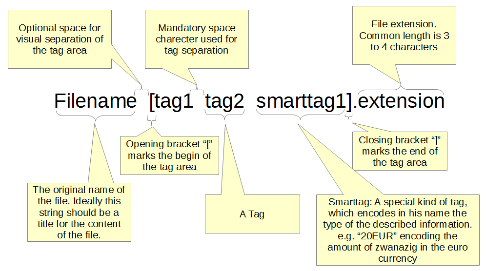

# Organize your data with tags

## Motivation
Tagging and tags is fresh and better alternative of categorizing and grouping things.
Tagging allows people to call thing with their own words. They don’t need to conform with keywords or categories in internet created by somebody else. Allow them to describe what they’re seeing in their own words, to imbue the experience with their own meaning. Tagging spares of your time, it creates a variety of tags in different sites and can make the searching for a specific song or a movie or a book or whatever you’re looking for much more easy and faster.

Tags are personal thing. Tagging something is your emotional response and not simply a taxonomic decision. With using tags, people have the control to define things in the web - not only for music, literature, games and movies, but also public websites, data repositories and consultations. Tagging is a new indirect way of control to express your mind and to call things your way - you can call it a "form of freedom of speech" if you want to go that far. Tagging is a power to create your own genres in movies and music for example.

## File Tagging based on filename{#file-tagging}

TagSpaces supports tagging of files in a multi platform way. It uses basically the name of the file to save this kind of meta information. As an example if you want to add the tags `vacation` and `alps` to a image named `IMG-2653.jpg`, the application will simply rename it to `IMG-2653[vacation alps].jpg`. File renaming is of course very controversial decision (see our users [discussion]), with its own limitations (on some operating systems the file path length is limited to ca. 256 characters), but it allows a portable way for adding tags on every platform (even cloud based).

## Tagging with Drag & Drop

The user interface of the application is design to be usable on touch screens, but for the pure desktop, we support many drag & drop operation such as:

* Adding tags from the tag groups to files in the list & grid perspectives and to the file viewer
* Moving tags from one tag group to another

<video src="/media/tagspaces-drag-drop.mp4" autoplay="true" loop="true" poster="/media/tagspaces-drag-drop.png" class="img-responsive"></video>

## Folder Tagging {#folder-tagging}

## File Tagging based on sidecar files <i class="profeature"></i>

## Transferring tag groups

